# FAQ Chatbot with Voice Assistance

## Objective
The primary goal of this project is to create an FAQ chatbot that can autonomously answer frequently asked questions (FAQs) of the users. Typically, FAQs are addressed by humans, but this project proposes a chatbot that can handle these queries efficiently. In addition to answering textual queries, if a user is dissatisfied with the chatbot's response, the system transfers control to a human agent, who provides the answer and updates the database with the new information.

## Features
- **Automated FAQ Responses**: The chatbot can respond to user queries using a predefined set of FAQs stored in the database.
- **Voice Assistance**: The chatbot can use speech recognition and text-to-speech to interact with users through voice.
- **Agent Intervention**: If the chatbot's response is not satisfactory, control is passed to a human agent for further assistance.
- **Database Update**: When the human agent provides a new answer, it is saved into the database for future use.

## Technologies Used
- **Python**: Core programming language.
- **CustomTkinter**: Used for creating the GUI of the application.
- **SpeechRecognition**: To process and recognize user queries spoken via voice.
- **Pyttsx3**: Text-to-speech conversion for chatbot responses.
- **MySQL**: Database for storing FAQs and updating queries.
- **SMTP**: Used for email integration in case the system needs to notify the user or the agent.

## Installation

1. Clone the repository:
   ```bash
   git clone https://github.com/reddynalamari/FAQ-ChatBot-With-Voice-Assistant.git
   ```
2. Install required dependencies:
   ```bash
   pip install -r requirements.txt
   ```
   - `requirements.txt` includes:
     - `customtkinter`
     - `speech_recognition`
     - `pyttsx3`
     - `mysql-connector-python`
     - Other required libraries

3. Set up your MySQL database and read [Setup](setup.txt) file carefully

4. Run the application:
   ```bash
   python main.py
   ```

## How It Works

1. **User Interaction**: Users ask questions through text or voice.
2. **FAQ Matching**: The chatbot checks the database to match the query with an existing FAQ.
3. **Agent Support**: If the user is not satisfied, the system transfers control to an agent who answers the query.
4. **Database Update**: The agent’s new answers are added to the database to enhance future responses.

## Contributors
- [Nalamari Shashidhar Reddy](https://github.com/reddynalamari)
- Yuva Tejasri
- Divya Teja

## License
This project is licensed under the MIT License - see the [LICENSE](LICENSE) file for details.

## Screens
Main Frame<br>
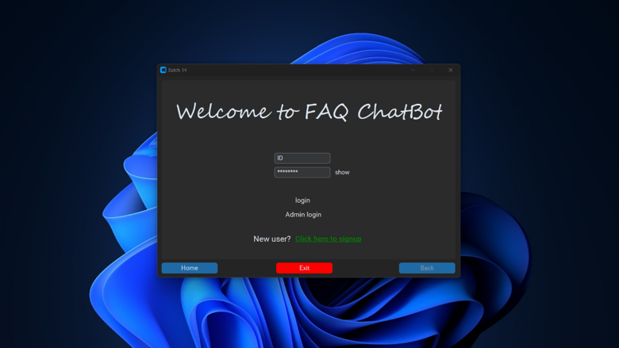<br>
Admin Screen<br>
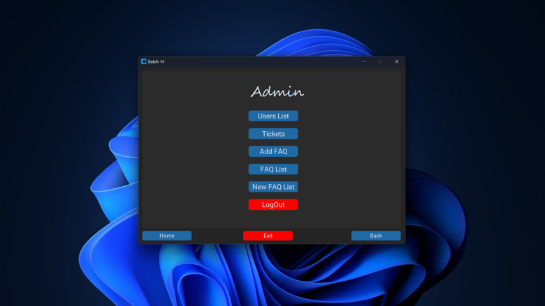<br>
All users<br>
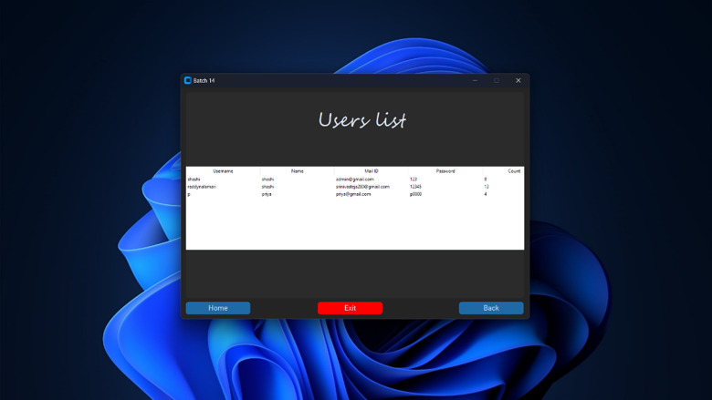<br>
Tickets Raised by the users<br>
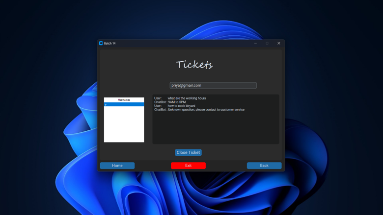<br>
Adding new FAQ<br>
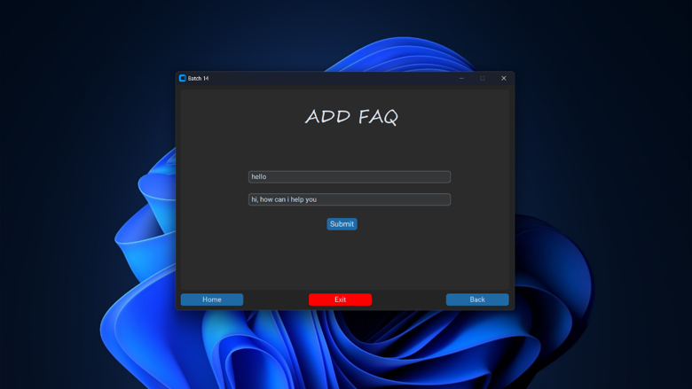<br>
All FAQs<br>
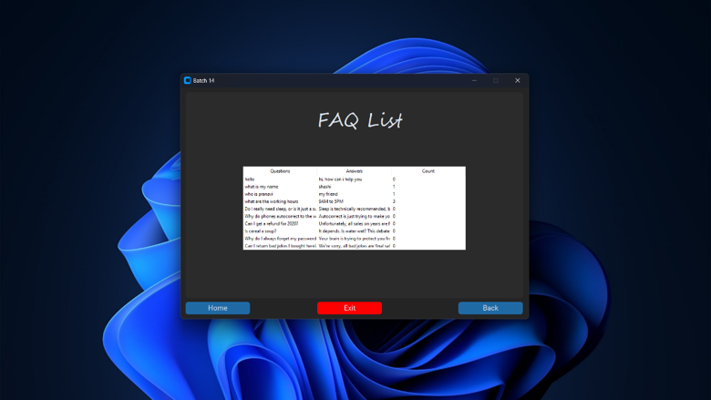<br>
Adding new FAQ which is asked by the user<br>
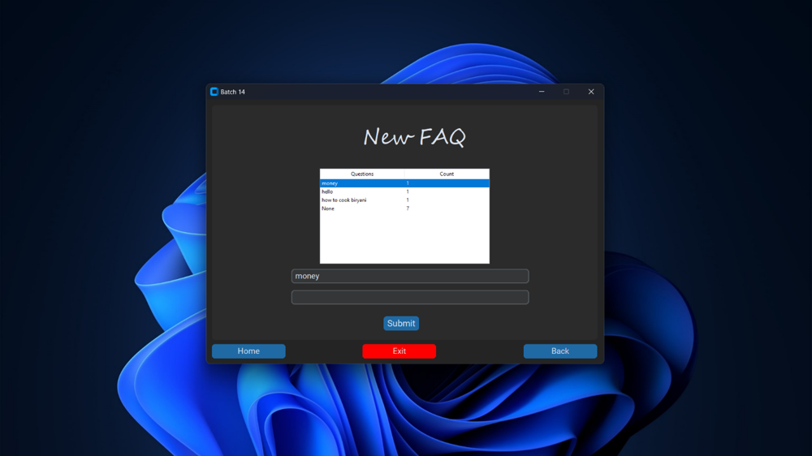<br>
Signup screen for the user<br>
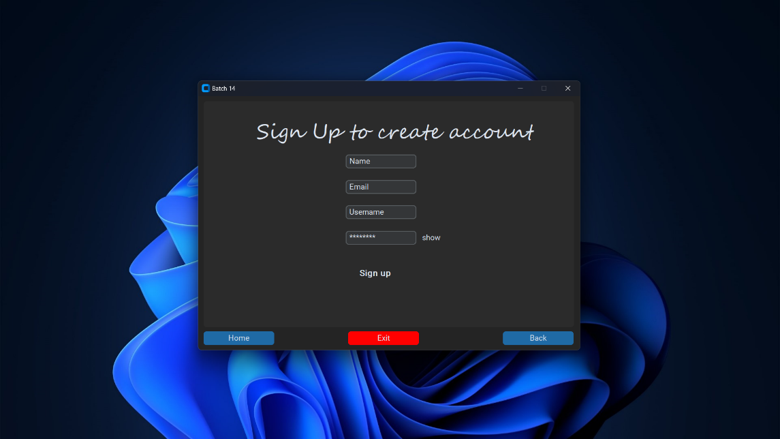<br>
OTP page<br>
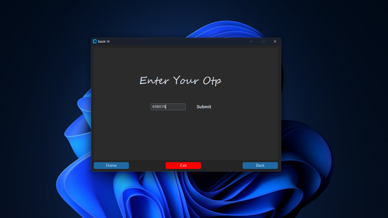<br>
User Screen<br>
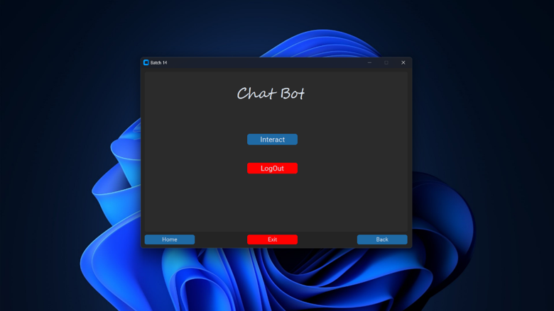<br>
Interacting with ChatBot<br>
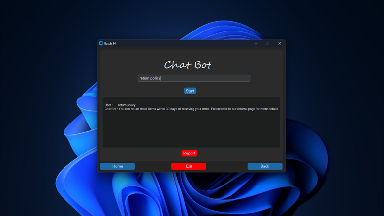<br>
Asking Unknown Question<br>
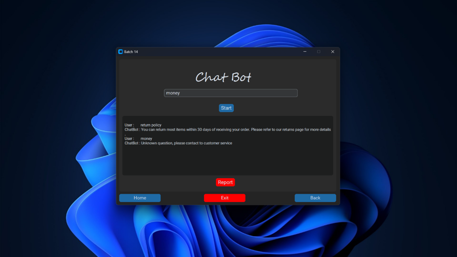<br>
